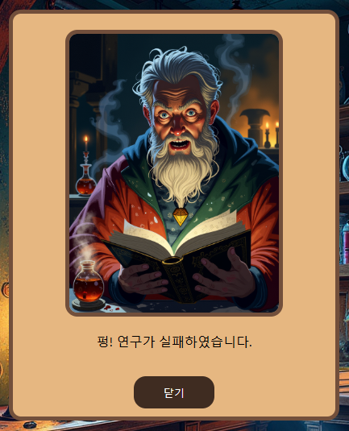

# Chess Teaching 배움의 재미를 더하다

## 프로젝트 개요
* 시작하게 된 계기
  * 기존 체스 사이트는 학습에 치중되어 있어 사용자에게 체스를 게임으로서 재미를 느끼게 하여 흥미를 가질 수 있는 사이트를 만들어보고자 하였습니다.
* 주요 기능 및 목적
  * 인공지능과의 실시간 대련, 체스 조언, 대화형 챗봇, 기보 분석을 통한 조언
  
## 기술 스택
* Node.js
* React

## 사용된 인공지능
* ChatGpt : 개발 과정에서 사용되었습니다.
* Ollama : 대화형 채팅봇, 기보 분석에 사용되었습니다.
* Stockfish : 사용자와의 체스 대련, 체스 조언에 사용되었습니다.

[BackEnd 주소입니다.](https://github.com/goshin1/ChessTeaching_BackEnd)

## 구현 설명
### 시작 페이지
실행|설명
---|---|
| 흑과 백 중 사용자가 원하는 색상을 선택하여 게임을 시작합니다.

### 메인 페이지
실행|설명
---|---|
| 게임 시작 시 나오는 페이지로 왼쪽부터 룰렛, 보드, 기보입니다. 가운데 보드에서 인공지능과 체스를 대련할 수 있습니다.

### 룰렛
실행|설명
---|---|
| 턴마다 한번 씩 돌릴 수 있으며, 여기서 확률적으로 조언을 받을 수 있습니다. 하지만 운이 나쁘면 패널티가 부여 됩니다.

실행|설명
---|---|
| 조언이 나온 경우 사진처럼 어디 위치로 이동하면 좋은지 알려줍니다.
| 실패할 경우 별도의 패널티 없이 넘어가며, 다음 턴에 다시 룰렛을 돌릴 수 있습니다.
| 수상한 안개는 화면의 안개가 나와 보드판을 가리며 다음 턴에 다시 룰렛을 돌릴 때까지 유지 됩니다.
| 사진처럼 보드판을 가리며, 안개는 위 아래로 움직이며 안개가 가리는 부분의 기물은 클릭할 수 없습니다.
| 한눈팔기로 사용자의 턴을 넘기고 인공지능이 다시한번 둡니다.

### 채팅 봇
실행|설명
---|---|
| 대화형 채팅 봇을 통해 체스를 플레이 하는 도중 궁금한 점이 생기면 실시간으로 질문을 할 수 있습니다.

### 기보 분석
실행|설명
---|---|
| 게임이 끝나면 사용자가 둔 기보를 분석하여 조언을 해줍니다.

